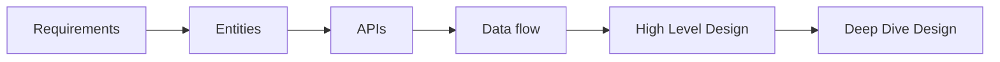

# How to do system design interview

## Delivery Steps

Using following steps approach towards building a high level design first to satisfy functional requirements and then at last deep dive to address non-functional requirements.



### 1. Requirements

To clearly understand the requirements of system to design, start with gathering functional requirements and then non-functional requirements. Clarify any assumptions made and once agreed upon then move to the next step.

#### Functional Requirements

These are core features of the system and should be ironed out in the step. Ask targeted questions to interviewer to finalize the features. Try to finalize top 3 features otherwise it can get complicated if you try to design a whole system and nearly impossible to do that within a set interview time limit.

```
Example: Design system like Twitter (X)

Functional Requirements:
1. User is able to post a tweet
2. User is able to view tweets
3. User is able to follow other users
```

#### Non Functional Requirements

These requirements will dictate how system should behave and expect to work. Think about CAP theorem, scalability, latency, security, fault tolerance, durability or any other compliance requirements.

```
Example: For Twitter like system
1. System should be highly available
2. System can have eventual consistency in showing the tweets
3. System should be able to scale to 100M+ DAU
4. System should have low latency and able to render feed within 200ms
```

### 2. Entities

Identify core entities of the system - it will help to understand the data important to design and gives a foundation to build on.
APIs will exchange based on these entities and system will persist in data model. No need to list down entire entities in this step because as you will progress you will uncover more entities to add on. When naming entities then try to chose good names as that makes it easier to follow and showcase you're good at hardest problem in computer science i.e. naming variables.
Start small and then iterate as progressing in the design.

```
Example: Core entities for Twitter:
1. User
2. Tweet
3. Follow
```

### 3. APIs

This is a good step to identify which type of APIs are required - REST or GraphQL. Usually it's REST, unless there's an absolute need to fetching only those fields which are required in the frontend.
Then design APIs contracts for core entities.

```
Example: Tweet
POST /v1/tweet
body {
    "text": string
}

GET /v1/tweet/:id -> tweet
POST /v1/follow/:userId
GET /v1/feed/
```

### 4. Data flow

In some systems this step will be helpful to set the sequence of how actions or events will occur.

### 5. High Level Design

By this step there's a clear understanding of entities and APIs - start with drawing a high level design.
Draw different components of the system and interactions between them. Keep this step as simple as that it satisfies designed APIs and functional requirements that were identified.

Note: Talk through the thought process as drawing the system. Be explicit about data flows, request/response between API calls.

### 6. Deep Dive

In this step address the inefficiency of the high level designed system and ensuring to meet a non-functional requirements, addressing edge cases.
Scale system, add caches, load balancers etc.

```
Example: Twitter should support 100M+ DAU
Suggest doing horizontal scaling, adding caches, database sharding. Updating high level design as we are discussing and uncovering.
```
