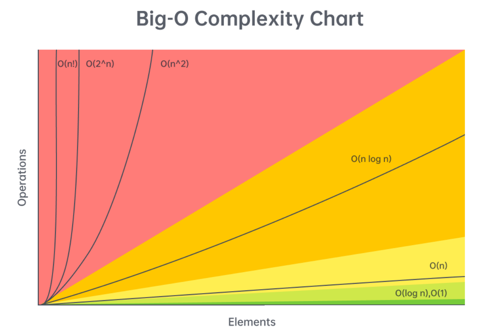

# Time Complexity (TC)

TC is not about the time taken to complete the task.
It's a relationship between the input size and time - to measure how time will grow as the input grows.

`TC !=== Time Taken`

In general we are not concerned about the small input size as anyways it will be computed with minor time variation. But, when input grows it will matter how efficient algorithm is.

```
10 users using website Vs 1 Million users using it. We will care to support for 1M as that can bring the worst case out of it.
```

Time complexity in increasing cost order:

```
O(1) < O(log n) < O(n) < O(n log n) < O(n^2) < O(2^n) < O(n!)
```

## How to calculate Time Complexity?

Using following rules we can calculate the time complexity:

1. Ignore all constants - because we care about the relationship but not the actual time taken.
2. Always ignore the less dominating terms.
3. Always consider the worst case complexity.

Example: O(3n^3 + 2n^2 + 5n + 9)\
Rule 1: Ignore all constants: O( ~~3~~ n^3 + ~~2~~ n^2 + ~~5~~ n + ~~9~~)\
Rule 2: Ignore less dominating terms: O( n^3 + ~~n^2~~ + ~~n~~)\
Rule 3: O(n^3)

## Common examples of Time Complexity

1. Sorting: O(n log n)
2. Array traversing: O(n)
3. Nested loop: O(n^2)
4. Nested loop of 2 different arrays: O(n\*m)
5. Binary Search: O(log n)
6. Hashmap lookup: O(1)

Read more in leetcode: https://leetcode.com/explore/interview/card/leetcodes-interview-crash-course-data-structures-and-algorithms/713/interviews-and-tools/4547/


